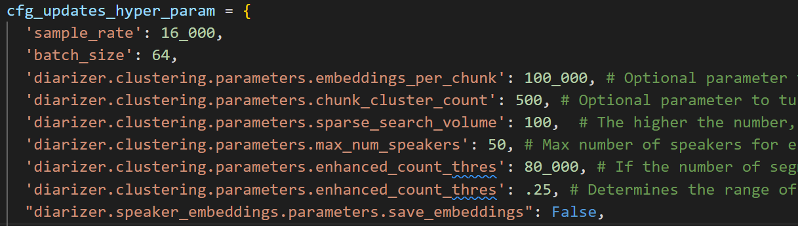

[ProtoPomp Website](protopomp.com)

[ProtoPomp YouTube](youtube.com/@protopomp)

# Automated RVC Data Processing
*Data preprocessing for RVC can be as easy as a single command.*
This is an opensource Python tool to automate RVC data preprocessing.

## Primary Toolkits used

## Basic Instructions
* Git clone the repository `git clone https://github.com/ProtoPompAI/Automated-RVC-Data-Preprocessing.git`
* Create a python 3.10 virtual environment i.e.`conda create -n Automated-RVC-Data python=3.10 && conda activate Automated-RVC-Data`
* Install requirements `pip install -r requirements.txt`
* Run the program by opening a command window and running the program as such `python preprocess_data.py INPUT_AUDIO_DIRECTORY OUTPUT_LOCATION`
* Use `python preprocess_data.py --help` to see the different ways to process raw input data.
* It is highly recommended to use audio files that are at most 25 minutes long. Splitting long audio can be done with the `-b` command line argument.

## Optional Addons
* By modifying the Excel file `Specified_Lines.xlsx` and adding the command line arguments `--specification_file` and `--speaker_label`, the command line program can extract a specific speaker out so the data can directly be fed into training an RVC or removing background audio.

## Implementation Notes
*Want to understand or modify this repository? Helpful details are below.*
* What tools are under the hood? What's the use of each tool?
  * [NeMo](https://github.com/NVIDIA/NeMo). Diarization.
  * [WhisperX](https://github.com/m-bain/whisperX). Transcription.
  * [FFmpeg](https://github.com/FFmpeg/FFmpeg). Manipulating audio files.
  * [Spacy](https://github.com/explosion/spaCy). Allows for truthy matches when comparing audio lines. Used in the optional speaker extraction to compare lines written in the Excel file and the WhisperX transcription.
* Why both NeMo and WhisperX? Both NeMo and WhisperX feature transcription as well as diarization capabilities.
  * After rigorous testing, it became clear in my experiments that NeMo had consistently better results in diarization tasks. In the same vein, WhisperX had consistently better results in pure transcription tasks. In fact, the VAD is done by WhisperX rather than the default NeMo tools.
* Are the settings for NeMo and WhisperX changed from default? If so, why?
  * For NeMo, clustering diarizer and the domain_type of meeting are used. All defaults are kept the same, apart from settings to allow NeMo to process longer audio files. These changes in settings have a very large impact on performance, making NeMo diarization use more resources and take longer. However, without these setting changes, NeMo will often only pick up a single speaker in longer audio files.
    * 
  * WhisperX settings are kept to defaults.